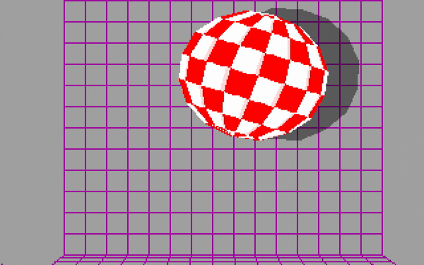

# amiga-boing



> 🌐 **Try it now — no emulator needed:** **[Live demo ▶](https://mbackschat.github.io/amiga-boing-web/)** — a browser port of this demo, source at **[mbackschat/amiga-boing-web](https://github.com/mbackschat/amiga-boing-web)**.

The famous **Amiga Boing Ball** demo (Dale Luck / R. J. Mical, 1984 CES) — the red-and-white checkered sphere bouncing in a magenta wireframe room — as buildable, heavily-annotated 68000 assembly, plus deep documentation of how it works.

The source here is the **AMICUS Disk 9 "polite" Boing** (a Commodore-Amiga developer sample), reconstructed from Harry "Piru" Sintonen's disassembly, split into readable files and commented. It assembles with `vasm`/`vlink` into a Kickstart 1.x / OCS executable and runs under FS-UAE. See [docs/DEMO-BACKGROUND.md](docs/DEMO-BACKGROUND.md) for the full history and variant lineage.

## Quick start

```sh
git submodule update --init      # fetch vendor/ (see "vendor/" below)
./scripts/build.sh               # assemble + link + stage the uae/ run target
./scripts/run.sh                 # launch the demo in FS-UAE
```

Close the FS-UAE window to quit. Full details and per-OS notes: **[docs/RUNNING.md](docs/RUNNING.md)**.

**Requirements:** `vasmm68k_mot` + `vlink` (bundled with the VS Code [amiga-assembly](https://marketplace.visualstudio.com/items?itemName=prb28.amiga-assembly) extension, or on your `PATH`); **FS-UAE**; and the contents of **`vendor/`** (below).

## `vendor/` — copyrighted files you must supply

The build needs three third-party, copyrighted components that are **not** redistributable, so they live in a separate **private** git submodule ([`amiga-boing-vendor`](https://github.com/mbackschat/amiga-boing-vendor)) rather than in this repo:

```
vendor/
  include/   Amiga 1.3 NDK assembler headers (*.i)   © Commodore-Amiga, Inc.
  libs/      mathtrans.library                       © Commodore-Amiga + Motorola FFP firmware
  rom/       kick13.rom  (Kickstart 1.3,  r34.5)     © Commodore / Cloanto   (required — native OS)
  rom/       kick204.rom (Kickstart 2.04, r37.175)   © Commodore / Cloanto   (optional — default boot ROM when present)
```

If you have access, `git submodule update --init` fetches them. **If you don't**, supply your own copies in that exact layout — e.g. the NDK 1.3 includes and Kickstart ROMs (**1.3 required**, 2.04 optional) from [Cloanto Amiga Forever](https://www.amigaforever.com/), and `mathtrans.library` from a Workbench 1.3 disk. `scripts/build.sh` requires the 1.3 ROM and uses 2.04 as the default boot ROM when it's present; it tells you what's missing.

## Layout

```
src/                 demo sources (assembled into one binary)
  boing.s              vasm entry point — INCLUDEs the five .s files below
  startup.s            Lattice C c.o startup boilerplate
  anim.s               _Boing audio per-frame + audio.device setup + sample DATA
  globe.s              _init_globe / _draw_globe — sphere math + polygon fill
  main.s               _main, the main loop, physics, palette cycling, globals
  runtime.s            Lattice C runtime + library glue stubs
  assets/
    boing.samples        the "BOING!" 8-bit PCM
    Boing.info           Workbench icon
    uae/                 FS-UAE run-target skeleton (config + startup-sequence + UAEquit)
vendor/              copyrighted NDK includes / mathtrans.library / Kickstart ROM (private submodule)
scripts/             build.sh, run.sh
docs/                analysis & reference (see below)
specs/               handoff spec for a separate browser-port project
archive/             unmodified originals (Sintonen disasm + Maher's C reconstruction)
uae/                 generated FS-UAE run target (git-ignored; staged by build.sh)
build/               assembler output (git-ignored)
```

## Documentation

- **[docs/RUNNING.md](docs/RUNNING.md)** — build & run (macOS / Linux / Windows), toolchain, `vendor/`, gotchas.
- **[docs/DEVIATIONS.md](docs/DEVIATIONS.md)** — the two deliberate changes this repo makes to the original AMICUS source (auto-start; KS2.0+ frame-rate fix), and how to re-verify.
- **[docs/ANIMATION-DETAILS.md](docs/ANIMATION-DETAILS.md)** — motion/timing/distances, measured from a UAE recording and reconciled with source (for recreating the animation).
- **[docs/BOING-ANALYSIS.md](docs/BOING-ANALYSIS.md)** — per-function analysis of the source.
- **[docs/AMIGA-KNOWHOW.md](docs/AMIGA-KNOWHOW.md)** — Amiga 1000 hardware/OS reference, scoped to what this demo uses.
- **[docs/DEMO-BACKGROUND.md](docs/DEMO-BACKGROUND.md)** — history, cultural context, variant lineage.
- **[docs/BOING-AMICUS(S)-VS-MAHER(C).md](docs/BOING-AMICUS%28S%29-VS-MAHER%28C%29.md)** — comparison with Jimmy Maher's C reconstruction.

## Fidelity note

`src/` stays very close to the original AMICUS disassembly (`archive/boing_original.s`), with **two deliberate deviations**: auto-start (the original starts paused), and a Kickstart 2.0+ frame-rate fix (a version-gated commit block that keeps the demo at the native field rate — 50 Hz PAL / 60 Hz NTSC — on later OSes; KS1.x runs the original code path). The first is a one-value flip; the second adds a little code, so the build is no longer strictly byte-identical. Its screen handling is original: the ball screen opens in the **background**, so drag the CLI/Workbench screen's title bar down to reveal it. Full details: **[docs/DEVIATIONS.md](docs/DEVIATIONS.md)**; unmodified originals live in `archive/`.
